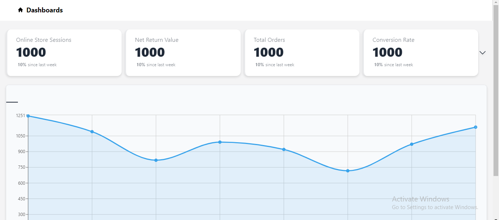
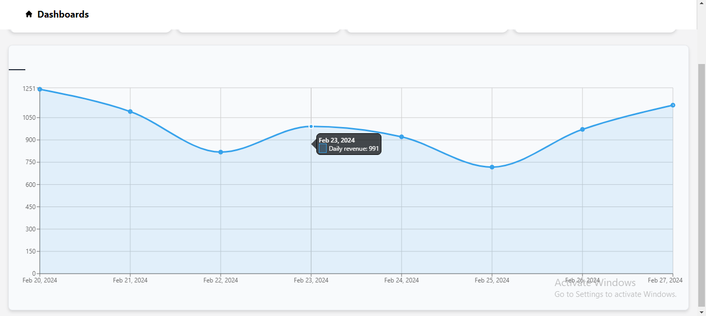

<div align="center" style="margin: 30px;">


Aapplication will be accessible at https://marbleai-9rua5dqcw-rittik24.vercel.app
<br />
<br />
</div>


## About

This example provides a great starting point to learn how to build a full-fledged admin panel by integrating [**daisyUI**](https://daisyui.com) with [**refine**](https://github.com/refinedev/refine)

**daisyUI** is a TailwinCSS based component templates library. It provides shorter, semantic class names composed from regular TailwindCSS classes that also come with responsive, color, size and shape variants. As such, daisyUI offers the convenience of using friendly class names to style markups while beautifying React code. On top of these, daisyUI classes can be overridden and extented. Besides, it lets us use regular TailwindCSS classes as well. In this example, you'll discover how to use daisyUI templates to style React components.

refine is a React-based powerful framework for building low-code applications. It is primarily focused on implementing data-heavy apps such as internal tools, dashboards, admin panels, and storefronts. It comes with a core package that segregates app concerns like data handling, authentication, access control, etc., into React contexts. It also supports integration with industry standard backend systems such and UI frameworks. It is highly customizable and extensible. In this example, you get an opportunity to learn how to integrate **daisyUI** with **refine** for building an admin panel app.

Refer to the complete tutorial of this app [here.](https://refine.dev/blog/daisy-ui-react-admin-panel/)

## Quick Start

Run the following command to download the project:

```
npm create refine-app@latest -- --example blog-refine-daisyui
```

Once the setup is complete, navigate to the project folder and start your project with:

```
npm run dev
```

Your application will be accessible at http://localhost:5173





### Resources

Refer to [daisyUI docs](https://daisyui.com/docs/install/) for more information.

